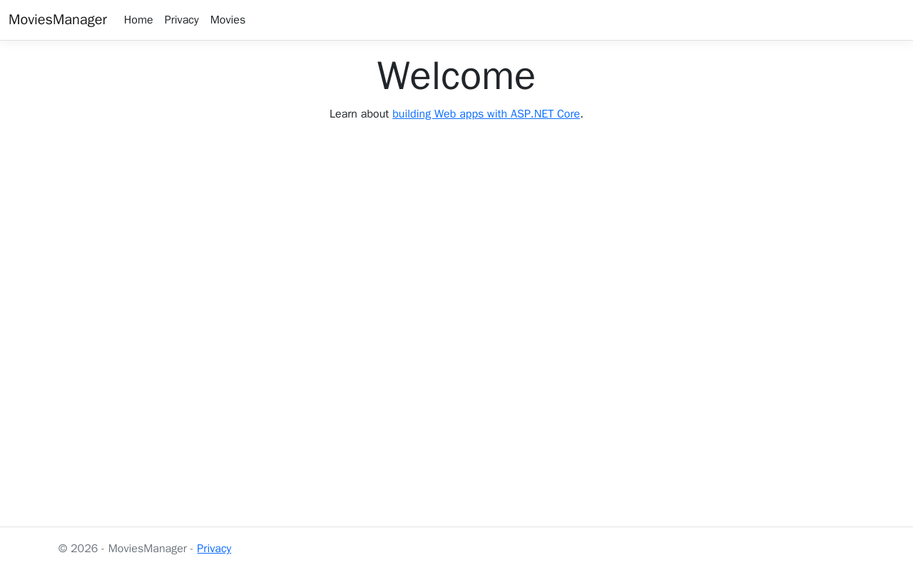
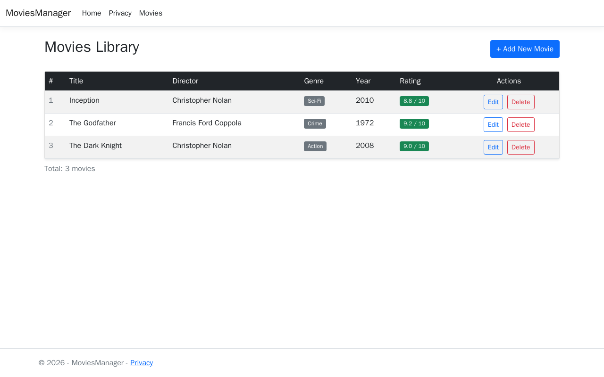
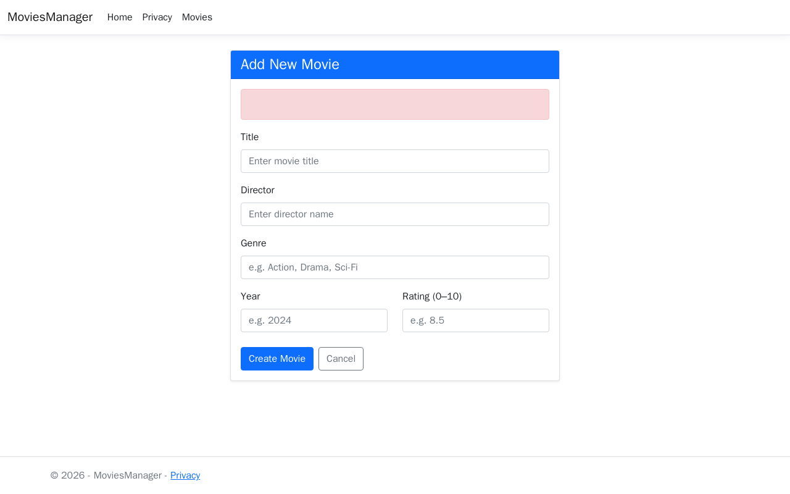
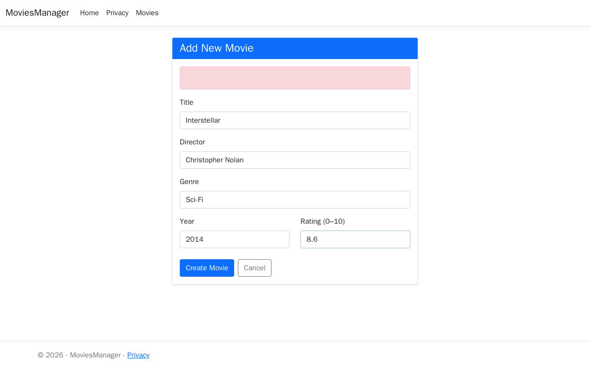
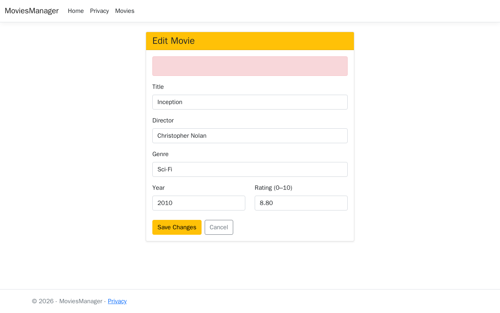
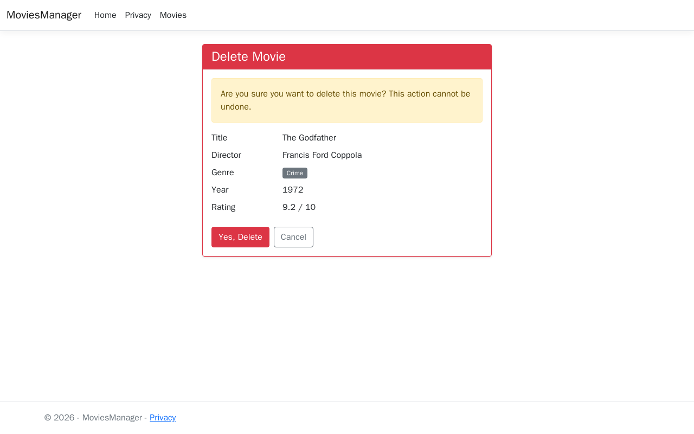
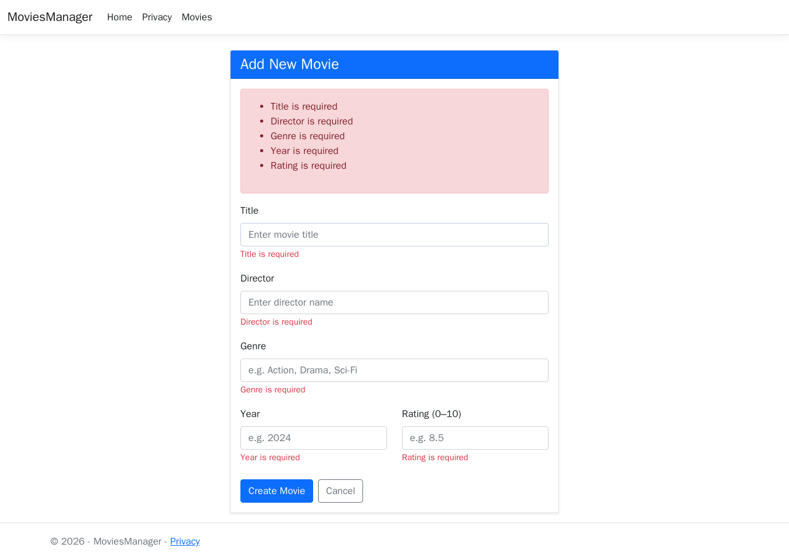
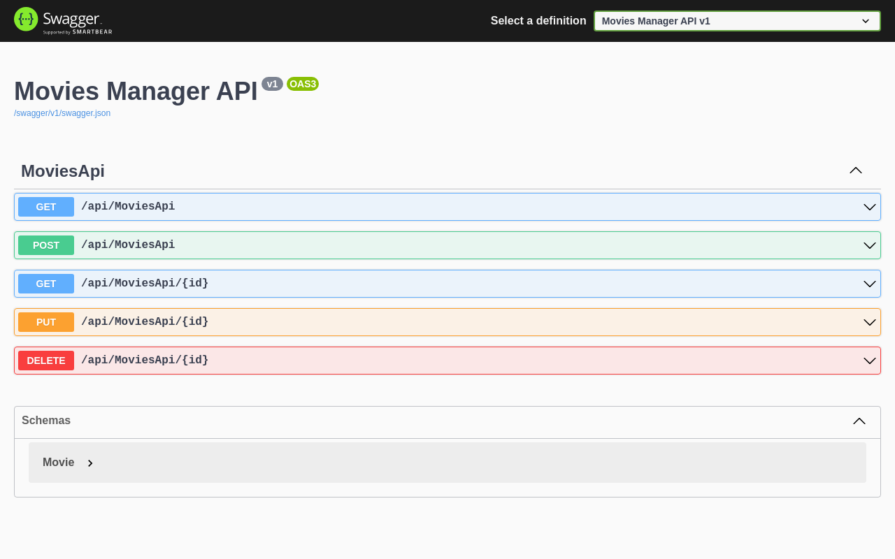

# Assignment 4 Report – CSD-3353 Web Applications in C#.NET

**Student:** Qi Chen  
**Weight:** 15%  
**Topic:** Final Enhancements – UI + Testing + Deployment

---

## Course Learning Outcomes

- **CLO 1:** Improve frontend styling using Bootstrap
- **CLO 5:** Debug and test application and deploy web application locally

---

## 1. Bootstrap Styling

Bootstrap 5 was applied throughout the application to improve layout, readability, and visual clarity.

**Key styling choices:**
- Navbar with brand link and navigation items
- `table-dark` header, `table-hover` and `table-striped` rows for the movies list
- Color-coded rating badges: green (≥8.0), yellow (≥6.0), red (<6.0)
- Genre displayed as `badge bg-secondary`
- Card layout with colored headers for Create (blue), Edit (yellow), Delete (red) forms
- Responsive two-column layout for Year and Rating fields

### 1.1 Home Page



### 1.2 Movies List

The movies list uses a responsive Bootstrap table with color-coded rating badges and styled action buttons.



### 1.3 Create Movie Form

The create form uses a Card component with a blue header and placeholder text for each field.



### 1.4 Create Form – Filled In



### 1.5 After Creating a Movie

After a successful submission, the user is redirected to the updated movies list.


### 1.6 Edit Movie Form

The edit form uses a Card component with a yellow header and pre-populated fields.



### 1.7 Delete Confirmation Page

The delete page uses a danger-styled Card with a warning alert and full movie details before confirmation.



### 1.8 Form Validation Errors

Client-side and server-side validation errors are shown inline using Bootstrap alert and `text-danger` spans.



---

## 2. Logging with ILogger

`ILogger<MovieController>` was injected into the `MovieController` constructor and used across all actions.

**Log levels used:**
| Level | When |
|-------|------|
| `LogInformation` | Successful fetch, create, update, delete operations |
| `LogWarning` | Null IDs, missing records, validation failures |
| `LogError` | Database concurrency exceptions |

**Example log output (console):**
```
2026-04-08 17:09:36 info: MoviesManager.Controllers.MovieController
      Fetching all movies from database
2026-04-08 17:09:36 info: MoviesManager.Controllers.MovieController
      Retrieved 3 movies
2026-04-08 17:09:40 info: MoviesManager.Controllers.MovieController
      Created new movie: Interstellar (Id=4)
```

**Code sample (`MovieController.cs`):**
```csharp
public MovieController(MovieDbContext context, ILogger<MovieController> logger)
{
    _context = context;
    _logger = logger;
}

public async Task<IActionResult> Index()
{
    _logger.LogInformation("Fetching all movies from database");
    var movies = await _context.Movies.ToListAsync();
    _logger.LogInformation("Retrieved {Count} movies", movies.Count);
    return View(movies);
}
```

---

## 3. xUnit Testing

A separate test project `MoviesManager.Tests` was created using xUnit, with InMemory database and Moq for dependencies.

**Test dependencies:**
- `xunit` 2.6.2
- `Microsoft.EntityFrameworkCore.InMemory` 8.0.0
- `Moq` 4.20.70

### 3.1 Test Summary

| File | Tests | Covers |
|------|-------|--------|
| `MovieModelTests.cs` | 8 | Data annotation validation (`[Required]`, `[Range]`, `[StringLength]`) |
| `MovieControllerTests.cs` | 10 | CRUD actions, redirects, `NotFound` responses |
| **Total** | **18** | |

### 3.2 Model Validation Tests (`MovieModelTests.cs`)

| # | Test | Expected Result |
|---|------|----------------|
| 1 | Valid movie with all fields | Passes validation |
| 2 | Empty `Title` | Fails – Title required |
| 3 | `Rating` above 10 | Fails – out of range |
| 4 | `Year` before 1888 | Fails – out of range |
| 5 | `Title` shorter than 2 chars | Fails – minimum length |
| 6 | `Rating` of exactly 0.0 | Passes validation |
| 7 | `Rating` of exactly 10.0 | Passes validation |
| 8 | Empty `Director` | Fails – Director required |

### 3.3 Controller Tests (`MovieControllerTests.cs`)

| # | Test | Expected Result |
|---|------|----------------|
| 1 | `Index()` | Returns view with all seeded movies |
| 2 | `Create()` GET | Returns view |
| 3 | `Create()` POST with valid data | Saves to DB, redirects to Index |
| 4 | `Edit()` GET with valid id | Returns view with correct movie |
| 5 | `Edit()` GET with null id | Returns `NotFound` |
| 6 | `Edit()` GET with non-existent id | Returns `NotFound` |
| 7 | `Delete()` GET with valid id | Returns view with movie |
| 8 | `DeleteConfirmed()` POST | Removes movie, redirects to Index |
| 9 | `Create()` POST with invalid model | Returns view (no redirect) |
| 10 | `Delete()` GET with null id | Returns `NotFound` |

**Run tests with:**
```bash
dotnet test MoviesManager.Tests/
```

---

## 4. Deployment

The application was deployed locally using `dotnet publish` and Docker.

### 4.1 dotnet publish

```bash
# Publish release build
dotnet publish -c Release -o ./publish

# Run the published application
cd publish
dotnet MoviesManager.dll
```

### 4.2 Docker Deployment

A `Dockerfile` was provided to build and run the app in a container:

```bash
# Build Docker image
docker build -t movies-manager:a4 .

# Run container on port 8080
docker run -d --name movies-app -p 8080:5000 \
  -e ASPNETCORE_URLS=http://+:5000 \
  movies-manager:a4
```

Application is accessible at: `http://localhost:8080`

### 4.3 Swagger API

The REST API is documented and accessible at `http://localhost:8080/swagger`.



---

## 5. Project Structure

```
Assignment4/
├── Controllers/
│   ├── HomeController.cs
│   ├── MovieController.cs          ← ILogger<MovieController> added
│   └── MoviesApiController.cs
├── Data/
│   └── MovieDbContext.cs
├── Models/
│   └── Movie.cs
├── Views/
│   └── Movie/
│       ├── Index.cshtml            ← Bootstrap table, color-coded badges
│       ├── Create.cshtml           ← Card layout with blue header
│       ├── Edit.cshtml             ← Card layout with yellow header
│       └── Delete.cshtml           ← Danger card with confirmation
├── MoviesManager.Tests/
│   ├── MoviesManager.Tests.csproj
│   ├── MovieModelTests.cs          ← 8 model validation tests
│   └── MovieControllerTests.cs    ← 10 controller tests
├── screenshots/                    ← Playwright-generated screenshots
├── Dockerfile
├── appsettings.json               ← Logging config updated
└── README.md
```
