# In Class Activity 1

## AWS Account and IAM

**First name Last Name:** Qi Chen  
**Student number:** c0944666  
**Submission date:** March 15, 2026

## Description

This submission documents the AWS IAM setup process, including the account alias update, IAM user creation, administrative permissions assignment, MFA configuration, and budget setup.

## 1. Update the AWS account alias

I signed in to the AWS account and opened the IAM dashboard. The account alias was updated to match the student ID format required for the assignment.

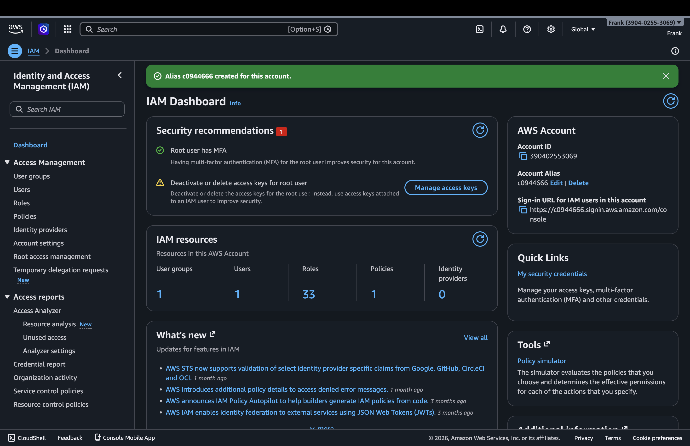

## 2. Create a new IAM user

I opened the IAM user creation flow and entered the new IAM username `Qi-Chen`.

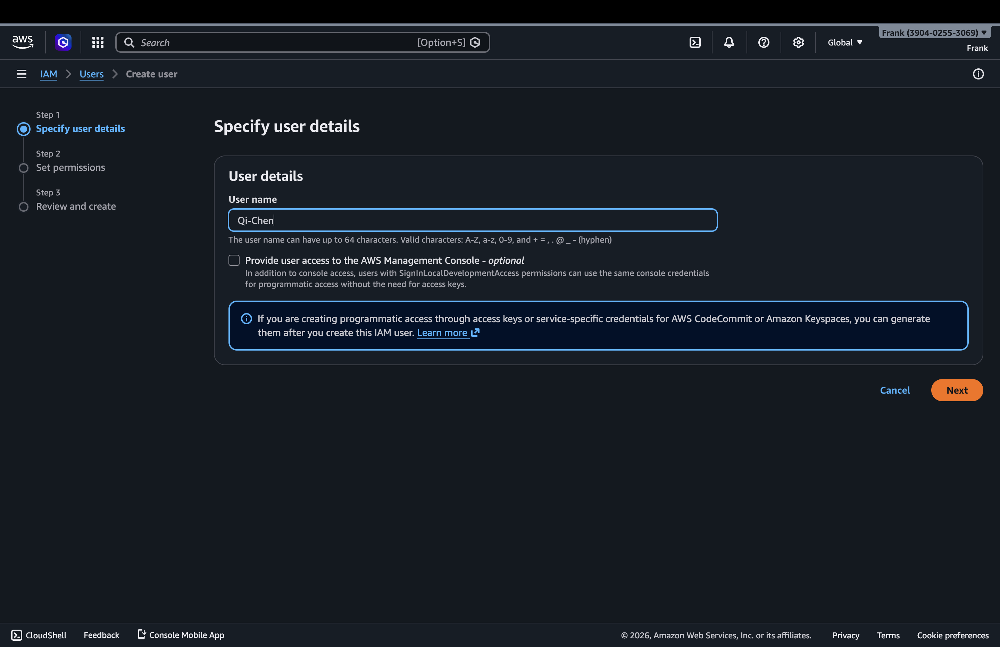

## 3. Assign administrative permissions

Next, I assigned the new user to an existing administrative group so the user would inherit full permissions through the attached administrator policy.

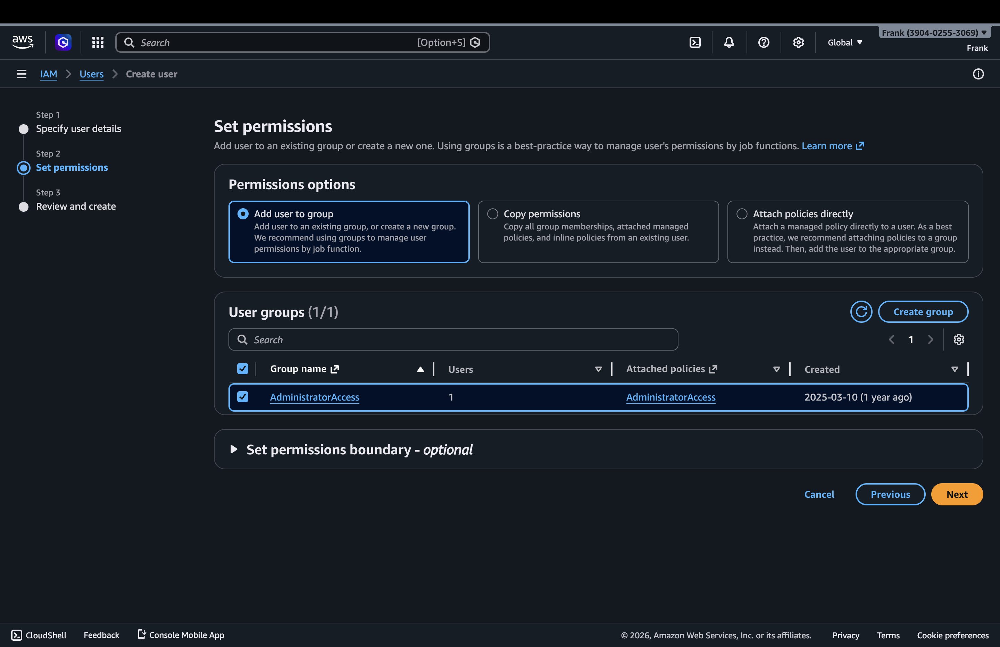

## 4. Review and create the user

Before submitting, I reviewed the username and the permission assignment to confirm the configuration was correct.

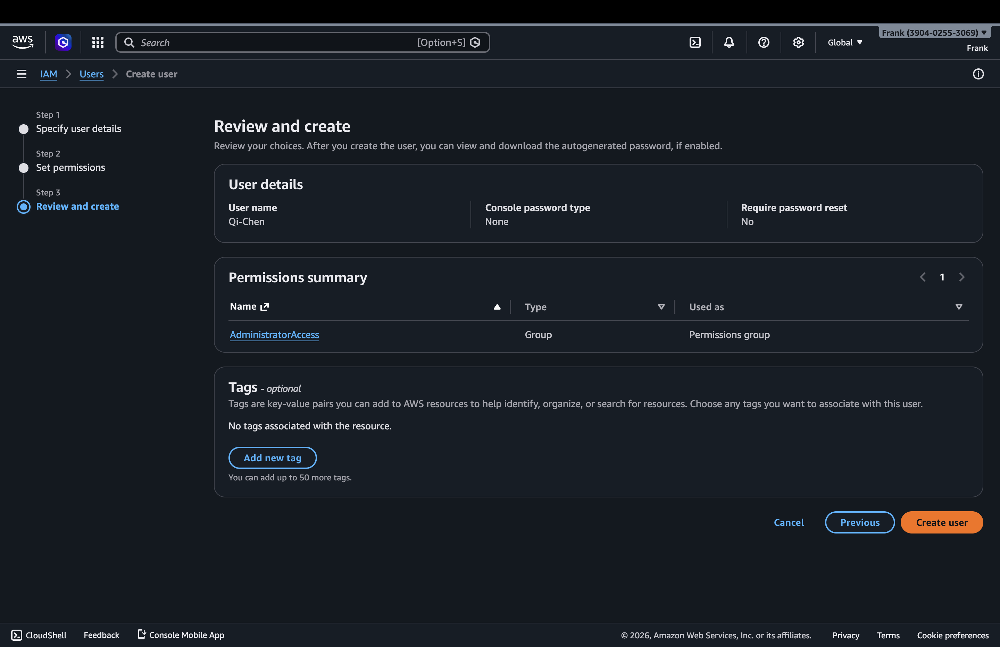

## 5. Confirm that the IAM user was created

After the user was created, AWS displayed a confirmation message and the new IAM user appeared in the Users list.

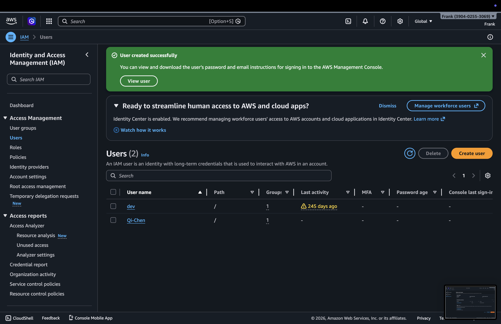

## 6. Verify the group permissions

I opened the administrative group to verify that the correct permission policy was attached to the group used for the new user.

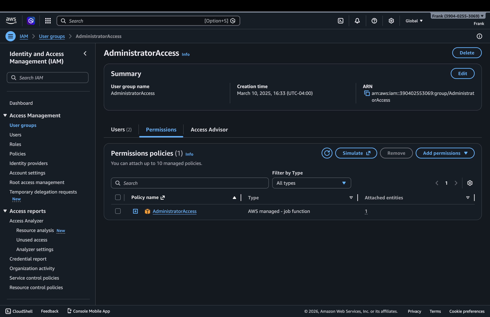

## 7. Verify full access in the administrator policy

The administrator policy details confirm that full access is granted across AWS services.

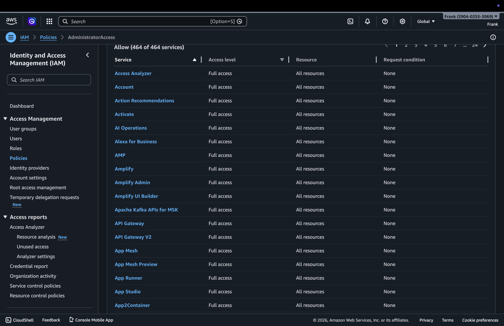

## 8. Start MFA setup

I then opened the MFA assignment flow for the IAM user and selected the authenticator app option.

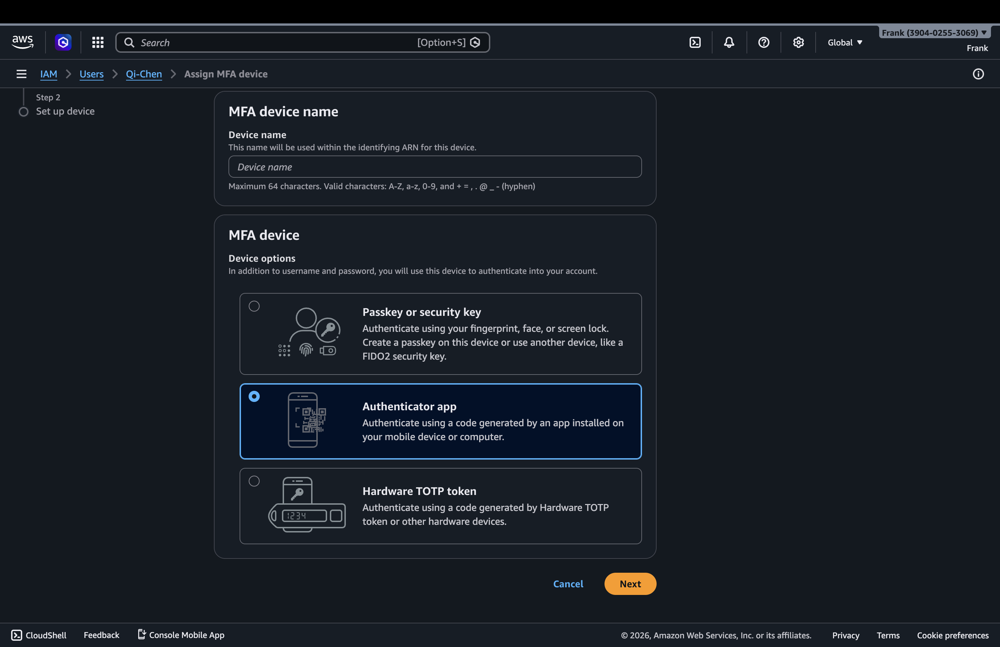

## 9. Configure the MFA device name

I provided a device name for the virtual MFA device and continued the setup process.

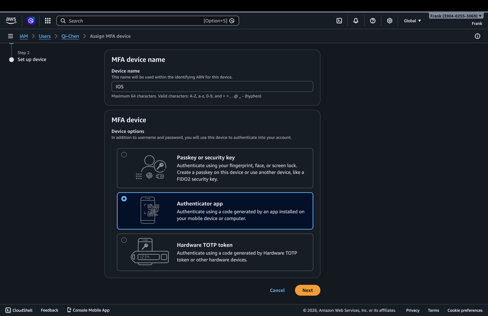

## 10. Confirm MFA is enabled

After completing the MFA registration, the user security credentials page showed the assigned virtual MFA device.

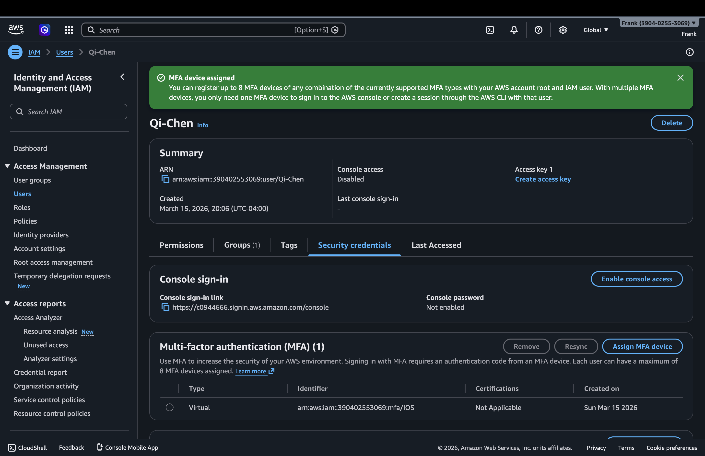

## 11. Create the zero-spend budget

I created a zero-spend budget to help monitor unexpected charges on the AWS account.

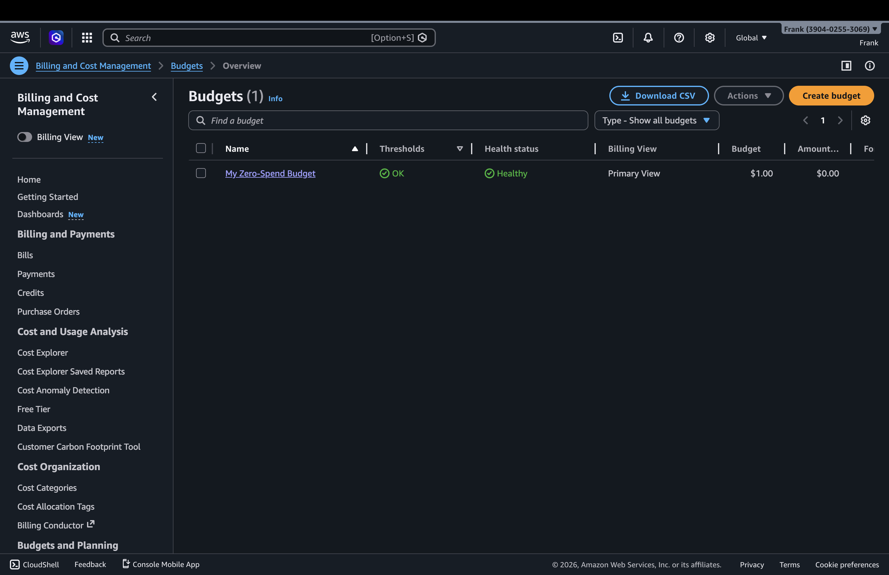

## 12. Create the monthly budget

Finally, I created a monthly cost budget. The budgets overview shows both the zero-spend budget and the monthly budget in the account.

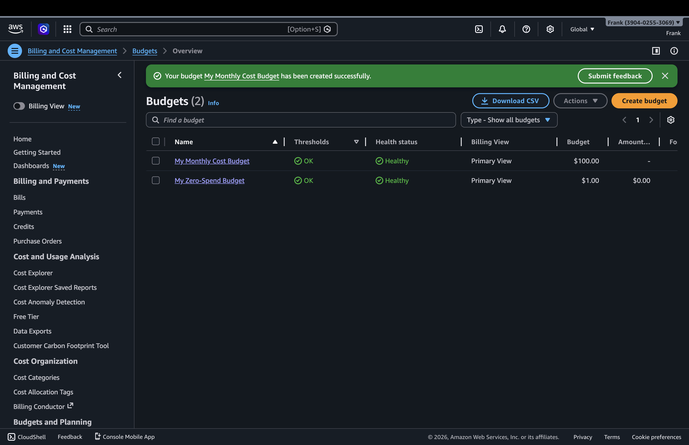

## Conclusion

The AWS IAM activity was completed by updating the account alias, creating a new IAM user, assigning administrator-level permissions through a group, enabling MFA, and creating both a zero-spend budget and a monthly budget.
