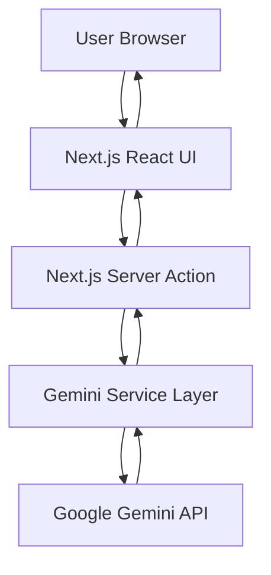
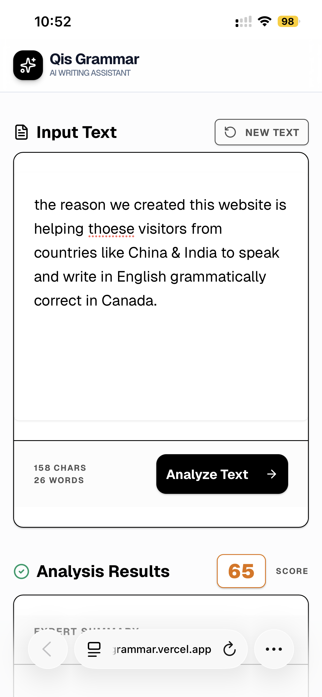
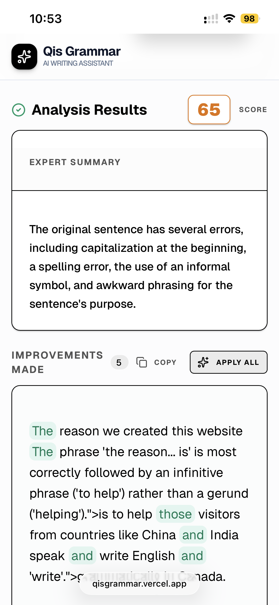
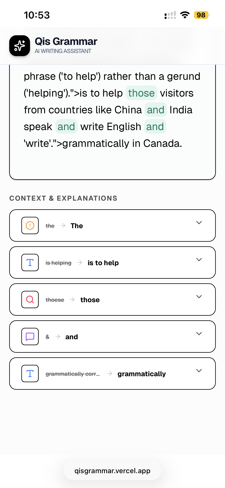

# Qis Grammar Checker Project Report

**Course:** CSD 4553 Cloud Computing  
**Instructor:** Chuck Fisher  
**Semester:** Winter 2026  
**Group Name:** Qis Innovations  
**Project:** Qis Grammar Checker  
**Project Lead:** Qi  
**Live Site:** <https://qisgrammar.vercel.app>  

## Group Members

| Name | Student Number | Role |
| --- | --- | --- |
| Patel Payal | C0959412 | Frontend and Presentation |
| Joel Meka | C0953406 | Backend and Integration |
| Qi | C0944666 | Cloud Deployment and Testing |
| Christo | C0956970 | Technical Documentation and Quality Assurance |

## Abstract

Qis Grammar Checker is a cloud-based AI writing assistant that helps users improve grammar, spelling, punctuation, clarity, and phrasing. The application allows users to paste or type text into a browser-based interface, submit it for AI analysis, and receive a structured result that includes a quality score, a summary of the writing quality, suggested corrections, detailed explanations, and a complete improved version of the text.

The project uses a modern serverless web architecture. The user interface is built with Next.js, React, Tailwind CSS, shadcn/ui components, Framer Motion, and Lucide icons. Grammar analysis is handled through a server-side integration with Google Gemini using the `@google/genai` SDK. The application is deployed on Vercel, which provides cloud hosting, automatic deployment, and serverless execution for the backend logic. This design makes the system accessible from any modern browser while keeping AI credentials protected on the server side.

## Statement of Need

Clear writing is important in academic, professional, and digital communication. Students need strong writing for assignments, reports, proposals, and research papers. Professionals need polished grammar and tone for emails, documentation, presentations, and business communication. Content creators also need tools that help them publish accurate and readable material quickly.

Traditional grammar tools can be limited when they only check spelling or simple grammar rules. They may miss context, tone, meaning, and phrasing issues. Qis Grammar Checker addresses this problem by using generative AI to analyze text in context and provide explanations, not only corrections. This helps users understand why a change is recommended and supports learning instead of only replacing incorrect words.

The public benefit of this project is improved access to writing assistance. Because the application runs in the cloud, users do not need a powerful local computer or installed desktop software. Students, educators, job seekers, and remote workers can use the tool from a browser to improve the quality and clarity of their writing.

## Project Objectives

- Build a browser-based grammar checking application.
- Use cloud-hosted serverless functions to process grammar analysis requests.
- Integrate a generative AI model for grammar, spelling, punctuation, and style feedback.
- Return structured results that are easy for users to understand.
- Provide a responsive user interface for desktop and mobile users.
- Deploy the application to a public cloud platform.
- Protect the AI API key by keeping it in the server environment.

## Target Audience

- **Students:** Improve essays, assignments, project reports, and research writing.
- **Professionals:** Improve emails, reports, proposals, and workplace documentation.
- **Content creators:** Edit articles, captions, posts, and scripts before publishing.
- **Educational institutions:** Provide accessible AI writing support for learners.
- **Non-native English writers:** Receive contextual corrections and explanations that support language learning.

## Technology Stack

| Layer | Technology |
| --- | --- |
| Frontend framework | Next.js 16 App Router |
| UI library | React 19 |
| Language | TypeScript |
| Styling | Tailwind CSS 4 |
| UI components | shadcn/ui and Radix UI primitives |
| Icons | Lucide React |
| Animation | Framer Motion |
| AI SDK | `@google/genai` |
| AI model | `gemini-3-flash-preview` |
| Cloud deployment | Vercel |
| Package manager | Bun |
| Code quality | ESLint |

## System Architecture

The application follows a serverless cloud architecture. The browser renders the Next.js user interface and sends text to a server action. The server action validates the request and calls the Gemini service layer. The Gemini service sends the prompt and response schema to the Google Gemini API. Gemini returns structured JSON, and the application displays the score, summary, corrections, explanations, and improved text to the user.



## Cloud Computing Components

### Vercel Hosting

The application is deployed to Vercel. Vercel hosts the Next.js application and provides automatic deployment from the source repository. This allows the team to update the application by pushing code changes, after which the cloud platform builds and deploys the latest version.

### Serverless Backend

The grammar checking request is handled by a Next.js Server Action in `apps/web/app/actions.ts`. This keeps backend logic close to the application while still running on the server. Serverless execution is suitable for this project because grammar checking requests are event-driven and do not require a continuously running custom backend server.

### Environment Variables

The Gemini API key is read from the server environment using `process.env.GEMINI_API_KEY`. This is important because the API key is not exposed in the browser. In local development, the key is stored in a `.env` file. In production, the key should be configured in the cloud deployment platform's environment settings.

### External AI Service

Google Gemini is used as the AI engine. The application sends user text to the model with a request for grammar, punctuation, spelling, and style analysis. The model is configured to return JSON that matches a defined schema, which improves reliability and makes the frontend easier to render.

## Main Features

### Text Input

Users can type or paste text into the main editor. The interface shows character and word counts, helping users understand the size of the text they are submitting.

### AI Grammar Analysis

When the user clicks **Analyze Text**, the application sends the text to the server action. The server action calls the Gemini service and returns a structured analysis result.

### Writing Quality Score

The application displays a score from 0 to 100 based on the grammar and clarity of the submitted text. The score is visually styled with different colors depending on the quality range.

### Expert Summary

The result includes a short summary of the writing quality. This gives the user a quick overview before reviewing the individual corrections.

### Correction List

Each correction includes:

- Original text
- Suggested correction
- Explanation
- Correction type: grammar, phrasing, punctuation, or spelling

### Improved Version

The AI returns a complete improved version of the submitted text. Users can copy the improved text or apply all changes back into the editor.

### Diff Highlighting

The improved text highlights corrected phrases so the user can quickly identify the changes. Tooltips provide the explanation for highlighted corrections.

### Responsive Interface

The interface uses a single-column layout before analysis and a split-view layout after results are generated on larger screens. This supports both focused writing and side-by-side review.

## Implementation Details

### Project Structure

```text
qis-grammar-checker-main/
+-- README.md
+-- PROJECT_REPORT.md
+-- res/
|   +-- p1.PNG
|   +-- p2.PNG
|   +-- p3.PNG
+-- apps/
    +-- web/
        +-- app/
        |   +-- actions.ts
        |   +-- globals.css
        |   +-- layout.tsx
        |   +-- page.tsx
        +-- components/
        |   +-- GrammarChecker.tsx
        |   +-- ui/
        +-- lib/
        |   +-- gemini.ts
        |   +-- utils.ts
        +-- package.json
        +-- tsconfig.json
```

### Server Action

The server action validates the input and catches errors from the AI service. If the text is empty, the user receives a clear error message. If the Gemini request fails, the application returns an error instead of crashing.

```ts
"use server";

import { checkGrammar, type GrammarCheckResult } from "@/lib/gemini";

export async function checkGrammarAction(
  text: string
): Promise<{ data?: GrammarCheckResult; error?: string }> {
  if (!text.trim()) {
    return { error: "Text is required" };
  }

  try {
    const result = await checkGrammar(text);
    return { data: result };
  } catch (error) {
    return {
      error: error instanceof Error
        ? error.message
        : "An unexpected error occurred",
    };
  }
}
```

### Gemini Integration

The Gemini integration is located in `apps/web/lib/gemini.ts`. It creates a Google GenAI client using the server-side API key and requests a JSON response. The response schema requires the model to return a score, summary, correction array, and improved version.

```ts
export interface GrammarCorrection {
  original: string;
  correction: string;
  explanation: string;
  type: "grammar" | "phrasing" | "punctuation" | "spelling";
}

export interface GrammarCheckResult {
  score: number;
  summary: string;
  corrections: GrammarCorrection[];
  improvedVersion: string;
}
```

### Frontend Component

The main user experience is implemented in `apps/web/components/GrammarChecker.tsx`. It manages the input text, loading state, result state, error state, copying behavior, and apply-all behavior. The component also renders correction explanations using an accordion interface.

Important frontend states include:

- `inputText`: stores the text entered by the user.
- `isAnalyzing`: controls the loading state.
- `result`: stores the AI grammar analysis result.
- `error`: stores validation or API errors.
- `copied`: controls copy confirmation feedback.

## User Interface Design

The interface is designed to be simple and direct. The user starts with one large text input area and an **Analyze Text** button. After analysis, the interface expands into a review workflow where the original text and AI result can be compared.

Design choices include:

- A sticky header with the product name.
- Large text input for comfortable writing.
- Clear loading state while analysis is running.
- Score badge for quick quality assessment.
- Cards for summary and improved text.
- Accordion rows for detailed correction explanations.
- Copy and apply-all actions for fast editing.
- Mobile-friendly layout through responsive grid behavior.

## Application Workflow

1. The user opens the deployed website.
2. The user types or pastes text into the editor.
3. The user clicks **Analyze Text**.
4. The client calls the Next.js server action.
5. The server action validates the input.
6. The Gemini service sends the text to the Gemini API.
7. Gemini returns a structured JSON response.
8. The frontend displays the score, summary, improved text, and correction explanations.
9. The user copies the improved version or applies all changes to the editor.

## Testing and Validation

The project was validated through functional testing and visual testing. Functional testing focused on confirming that the application accepts user input, sends text for analysis, handles loading states, and displays the returned results correctly. Visual testing focused on confirming that the interface remains readable and usable on different screen sizes.

Test cases included:

| Test Case | Expected Result |
| --- | --- |
| Submit empty text | Analyze button remains disabled or validation error is returned |
| Submit text with grammar mistakes | Application returns score, summary, corrections, and improved text |
| Click Copy | Improved text is copied and user receives copy feedback |
| Click Apply All | Improved version is placed back into the input editor |
| API key missing | Server returns a clear configuration error |
| Mobile viewport | Layout remains readable and controls stay accessible |

## Results

The final result is a working AI-powered grammar checking web application deployed to the cloud. The application successfully provides grammar and style feedback through a browser interface and uses server-side code to protect the Gemini API key.

The delivered project includes:

- Public Vercel deployment.
- Next.js web application.
- Gemini AI integration.
- Server action backend layer.
- Responsive UI with grammar review workflow.
- Screenshots documenting the application.
- Source code organized into frontend components, server actions, and service modules.

## Application Screenshots

### User Input and Initial Analysis



### Expert Summary and AI Highlights



### Detailed Explanations and Mobile UX



## Challenges and Solutions

### Challenge: Returning Reliable AI Output

Generative AI responses can vary in structure. To reduce parsing errors, the project uses a JSON response schema. This requires Gemini to return predictable fields such as `score`, `summary`, `corrections`, and `improvedVersion`.

### Challenge: Protecting the API Key

The Gemini API key should not be exposed to browser code. The solution was to place the Gemini call inside server-side code and read the key from the server environment.

### Challenge: Making Corrections Easy to Review

A plain corrected paragraph is useful, but it does not explain what changed. The project solves this by showing both a highlighted improved version and a detailed correction list with explanations.

### Challenge: Supporting Different Screen Sizes

The application needs to work on both desktop and mobile. The solution uses responsive layout behavior where the page can display a single-column workflow or a split-view comparison depending on available screen width.

## Limitations

- The current implementation depends on availability of the external Gemini API.
- Very long text may require additional token, timeout, or chunking logic.
- The diff highlighting is based on matching corrected snippets and is not a full semantic diff engine.
- The application does not currently include user accounts or saved history.
- The result quality depends on the AI model response and prompt behavior.

## Future Improvements

- Add user authentication and saved grammar history.
- Add document upload support for `.txt`, `.docx`, or PDF files.
- Add export options for corrected text.
- Add a full diff algorithm for more accurate before-and-after comparison.
- Add language selection and tone presets.
- Add usage analytics for monitoring performance and errors.
- Add automated unit and end-to-end tests.
- Add rate limiting for production API protection.

## Conclusion

Qis Grammar Checker demonstrates how cloud computing and generative AI can be combined to create a practical writing assistant. The project uses a modern web stack, serverless backend execution, cloud deployment, and an external AI service to deliver real-time writing feedback. The final application is accessible, responsive, and useful for students, professionals, and other users who want to improve written communication.

The project meets the main final project goals by delivering a working software service, documenting its architecture, explaining the implementation, and showing the final result through screenshots and a deployed web application.

## References

Google. (n.d.). *Google Gen AI SDK documentation*. <https://googleapis.github.io/js-genai/>

Google. (n.d.). *Gemini API documentation*. <https://ai.google.dev/gemini-api/docs>

Vercel. (n.d.). *Next.js on Vercel*. <https://vercel.com/frameworks/nextjs>

Vercel. (n.d.). *Environment variables*. <https://vercel.com/docs/environment-variables>

Next.js. (n.d.). *Next.js documentation*. <https://nextjs.org/docs>

React. (n.d.). *React documentation*. <https://react.dev/>

Tailwind Labs. (n.d.). *Tailwind CSS documentation*. <https://tailwindcss.com/docs>

Radix UI. (n.d.). *Radix UI documentation*. <https://www.radix-ui.com/primitives/docs/overview/introduction>

shadcn. (n.d.). *shadcn/ui documentation*. <https://ui.shadcn.com/docs>

## Appendix A: Setup and Deployment Instructions

### Local Development

```bash
cd apps/web
bun install
```

Create a `.env` file:

```env
GEMINI_API_KEY=your_api_key_here
```

Run the development server:

```bash
bun dev
```

Open the local application:

```text
http://localhost:3000
```

### Production Deployment

1. Push the source code to GitHub.
2. Import the repository into Vercel.
3. Set the `GEMINI_API_KEY` environment variable in Vercel.
4. Build and deploy the Next.js application.
5. Open the deployed website and test the grammar checking workflow.

## Appendix B: Key Source Files

| File | Purpose |
| --- | --- |
| `apps/web/app/page.tsx` | Renders the main application page and header |
| `apps/web/components/GrammarChecker.tsx` | Implements the grammar checker UI and user interactions |
| `apps/web/app/actions.ts` | Handles server-side grammar checking requests |
| `apps/web/lib/gemini.ts` | Integrates with Google Gemini and parses AI results |
| `apps/web/app/globals.css` | Defines global styling and theme variables |
| `apps/web/package.json` | Defines scripts and dependencies |

## Appendix C: Core Source Code

### `apps/web/app/actions.ts`

```ts
"use server";

import { checkGrammar, type GrammarCheckResult } from "@/lib/gemini";

export async function checkGrammarAction(text: string): Promise<{ data?: GrammarCheckResult; error?: string }> {
    if (!text.trim()) {
        return { error: "Text is required" };
    }

    try {
        const result = await checkGrammar(text);
        return { data: result };
    } catch (error) {
        return { error: error instanceof Error ? error.message : "An unexpected error occurred" };
    }
}
```

### `apps/web/lib/gemini.ts`

```ts
import { GoogleGenAI, Type } from "@google/genai";

let aiInstance: GoogleGenAI | null = null;

function getAI() {
    const apiKey = process.env.GEMINI_API_KEY || "";
    if (!apiKey) {
        throw new Error("GEMINI_API_KEY is not set. Please add it to your .env file.");
    }
    if (!aiInstance) {
        aiInstance = new GoogleGenAI({ apiKey });
    }
    return aiInstance;
}

export interface GrammarCorrection {
    original: string;
    correction: string;
    explanation: string;
    type: "grammar" | "phrasing" | "punctuation" | "spelling";
}

export interface GrammarCheckResult {
    score: number;
    summary: string;
    corrections: GrammarCorrection[];
    improvedVersion: string;
}

export async function checkGrammar(text: string): Promise<GrammarCheckResult> {
    const ai = getAI();
    const response = await ai.models.generateContent({
        model: "gemini-3-flash-preview",
        contents: [
            {
                role: "user",
                parts: [
                    {
                        text: `Check the following text for grammar, punctuation, and style: "${text}"`
                    }
                ]
            }
        ],
        config: {
            responseMimeType: "application/json",
            responseSchema: {
                type: Type.OBJECT,
                properties: {
                    score: {
                        type: Type.NUMBER,
                        description: "A score from 0 to 100 based on grammar and clarity.",
                    },
                    summary: {
                        type: Type.STRING,
                        description: "A brief summary of the writing quality.",
                    },
                    corrections: {
                        type: Type.ARRAY,
                        items: {
                            type: Type.OBJECT,
                            properties: {
                                original: { type: Type.STRING, description: "The original incorrect snippet." },
                                correction: { type: Type.STRING, description: "The suggested correction." },
                                explanation: { type: Type.STRING, description: "Why this change is suggested." },
                                type: {
                                    type: Type.STRING,
                                    enum: ["grammar", "phrasing", "punctuation", "spelling"],
                                    description: "The category of the error."
                                },
                            },
                            required: ["original", "correction", "explanation", "type"],
                        },
                    },
                    improvedVersion: {
                        type: Type.STRING,
                        description: "The complete text with all improvements applied.",
                    },
                },
                required: ["score", "summary", "corrections", "improvedVersion"],
            },
        },
    });

    const candidate = response.candidates?.[0];
    const resultText = candidate?.content?.parts?.[0]?.text;

    if (!resultText) {
        throw new Error("Failed to get response from Gemini AI");
    }

    try {
        return JSON.parse(resultText) as GrammarCheckResult;
    } catch (error) {
        console.error("Failed to parse Gemini AI response:", resultText);
        throw new Error("Failed to parse the grammar check result.");
    }
}
```

### `apps/web/app/page.tsx`

```tsx
import { Sparkles } from "lucide-react";
import GrammarChecker from "@/components/GrammarChecker";

export default function Home() {
  return (
    <div className="min-h-screen bg-slate-50/50">
      <header className="bg-white/80 backdrop-blur-md border-b border-slate-200 sticky top-0 z-50">
        <div className="max-w-5xl mx-auto px-4 h-16 flex items-center justify-between">
          <div className="flex items-center gap-2">
            <div className="w-9 h-9 bg-primary rounded-xl flex items-center justify-center shadow-lg shadow-primary/20">
              <Sparkles className="w-5 h-5 text-white" />
            </div>
            <div>
              <h1 className="text-lg font-bold tracking-tight text-slate-900 leading-none">Qis Grammar</h1>
              <p className="text-[10px] font-medium text-slate-500 uppercase tracking-tighter">AI Writing Assistant</p>
            </div>
          </div>
        </div>
      </header>

      <main className="pb-20">
        <GrammarChecker />
      </main>
    </div>
  );
}
```

### `apps/web/components/GrammarChecker.tsx` Main Logic

```tsx
export default function GrammarChecker() {
    const [inputText, setInputText] = useState('');
    const [isAnalyzing, setIsAnalyzing] = useState(false);
    const [result, setResult] = useState<GrammarCheckResult | null>(null);
    const [error, setError] = useState<string | null>(null);
    const [copied, setCopied] = useState(false);

    const handleCheck = async () => {
        if (!inputText.trim()) return;

        setIsAnalyzing(true);
        setError(null);
        setResult(null);

        try {
            const response = await checkGrammarAction(inputText);
            if (response.error) {
                throw new Error(response.error);
            }
            if (response.data) {
                setResult(response.data);
            }
        } catch (err) {
            setError(err instanceof Error ? err.message : 'An unexpected error occurred');
        } finally {
            setIsAnalyzing(false);
        }
    };

    const handleCopy = (text: string) => {
        navigator.clipboard.writeText(text);
        setCopied(true);
        setTimeout(() => setCopied(false), 2000);
    };

    const handleApplyAll = () => {
        if (result?.improvedVersion) {
            setInputText(result.improvedVersion);
        }
    };

    const handleReset = () => {
        setInputText('');
        setResult(null);
        setError(null);
    };

    return (
        <div className="max-w-[1400px] mx-auto px-4 py-8">
            {/* The component renders the text editor, analysis button, score,
                improved text, copy/apply actions, and correction explanations. */}
        </div>
    );
}
```

### `apps/web/package.json`

```json
{
  "name": "qis-grammar-checker",
  "version": "0.1.0",
  "private": true,
  "scripts": {
    "dev": "next dev",
    "build": "next build",
    "start": "next start",
    "lint": "eslint"
  },
  "dependencies": {
    "@google/genai": "^1.42.0",
    "@radix-ui/react-accordion": "^1.2.12",
    "@radix-ui/react-alert-dialog": "^1.1.15",
    "@radix-ui/react-separator": "^1.1.8",
    "@radix-ui/react-slot": "^1.2.4",
    "class-variance-authority": "^0.7.1",
    "clsx": "^2.1.1",
    "framer-motion": "^12.34.3",
    "lucide-react": "^0.575.0",
    "next": "16.1.6",
    "radix-ui": "^1.4.3",
    "react": "19.2.3",
    "react-dom": "19.2.3",
    "react-markdown": "^10.1.0",
    "tailwind-merge": "^3.5.0"
  },
  "devDependencies": {
    "@tailwindcss/postcss": "^4",
    "@types/node": "^20",
    "@types/react": "^19",
    "@types/react-dom": "^19",
    "eslint": "^9",
    "eslint-config-next": "16.1.6",
    "tailwindcss": "^4",
    "typescript": "^5"
  }
}
```
