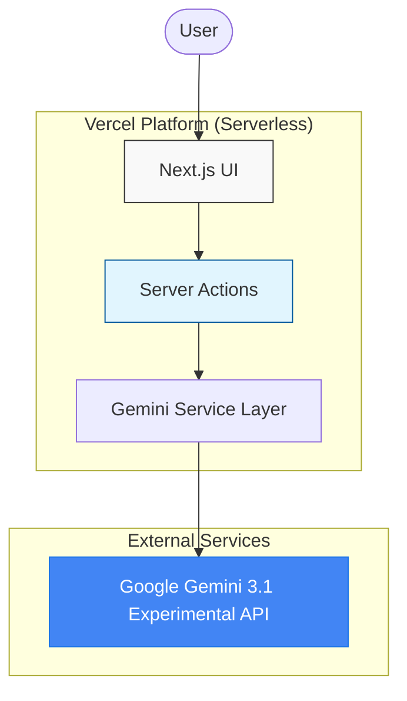

# Qis Grammar Checker 🖋️

**Live Site:** [qisgrammar.vercel.app](https://qisgrammar.vercel.app)

  

## Project Overview

  

**SD 4553 – Cloud Computing | Midterm Project**

**Instructor:** Chuck Fisher

**Semester:** Winter 2026

**Group Name:** Qis Innovations

  

**Team Members:**

1. Patel Payal C0959412- Frontend & Presentation

2. Joel Meka C0953406 - Backend & Integration

3. Qi c0944666 Cloud Deployment & Testing

4. Christo C0959412 - Technical Documentation & Quality Assurance

  

---

  

## 1. Abstract

  

**Qis Grammar Checker** is an intelligent, cloud-integrated writing assistant designed to elevate your content by detecting and correcting grammatical errors, spelling mistakes, and stylistic inconsistencies in real-time. By leveraging state-of-the-art **AI (Google Gemini 3.1 Experimental)**, the application provides high-accuracy suggestions and deep contextual explanations to reduce cognitive load during the editing process.

  

## 2. Statement of Need

  

Writing quality significantly impacts academic performance, professional communication, and business documentation. **Qis Grammar Checker** addresses the common challenges of grammatical accuracy and writing style by leveraging cloud computing. By integrating advanced Generative AI, it provides:

  

- **Real-Time Intelligence**: Instant feedback without the need for high local processing power.

- **Scalability**: Capable of processing diverse text lengths with high performance via serverless infrastructure.

- **Accessibility**: A cost-effective, high-availability solution accessible from any modern web browser.

  

## 3. Target Audience (Who Benefits)

  

- **Students**: Elevate academic writing, research papers, and essays.

- **Professionals**: Refine business communication, reports, and emails.

- **Content Creators**: Produce polished, error-free content for digital platforms.

- **Educational Institutions**: Provide students with accessible, AI-powered writing assistance tools.

  

## 4. Key Features (Current Implementation)

  

- **Split-View Comparison**: A side-by-side comparison of original and improved text for effortless review.

- **Intelligent Diff Highlighting**: Visual markers (with tooltips) that highlight exact changes and explain the underlying reasoning.

- **Contextual Explanations**: A structured "Context & Explanations" section driven by AI insights.

- **One-Click "Apply All"**: Seamless synchronization of AI corrections back to the main editor.

- **AI-Powered Quality Score**: Instant assessment of writing quality based on grammar, clarity, and tone.

- **Responsive & Modern UI**: Built with a "premium-first" design philosophy using shadcn/ui and Framer Motion.

  

## 5. Application Preview

  

<table style="width: 100%; border-collapse: collapse; border: none; page-break-inside: avoid; break-inside: avoid;">

<tr style="border: none;">

<td align="center" style="width: 33%; vertical-align: top; border: none; padding: 5px; page-break-inside: avoid; break-inside: avoid;">

<div style="page-break-inside: avoid; break-inside: avoid;">

<b>User Input & Initial Analysis</b><br/>


</div>

</td>

<td align="center" style="width: 33%; vertical-align: top; border: none; padding: 5px; page-break-inside: avoid; break-inside: avoid;">

<div style="page-break-inside: avoid; break-inside: avoid;">

<b>Expert Summary & AI Highlights</b><br/>


</div>

</td>

<td align="center" style="width: 33%; vertical-align: top; border: none; padding: 5px; page-break-inside: avoid; break-inside: avoid;">

<div style="page-break-inside: avoid; break-inside: avoid;">

<b>Detailed Explanations & Mobile UX</b><br/>


</div>

</td>

</tr>

</table>

  

## 6. System Architecture

  



  

## 7. Technology Stack

  

- **Frontend**: Next.js (App Router), React 18, Tailwind CSS.

- **UI Components**: shadcn/ui (Radix UI Primitives).

- **AI Engine**: Google Gemini 3.1 Experimental (via `@google/genai`).

- **Deployment**: Vercel (Automatic CI/CD via GitHub).

- **Styling**: Standardized global theme variables with full dark/light mode support.

  

## 8. Getting Started

  

### Prerequisites

- Node.js (v18+) or Bun

- A Google Gemini API Key

  

### Installation & Local Development

  

1. Clone the repository.

2. Navigate to `apps/web`.

3. Create a `.env` file and add `GEMINI_API_KEY=your_key_here`.

4. Install dependencies:

```bash

bun install

```

  

5. Run the dev server:

```bash

bun dev

```

  

---

  

## 9. Results & Final Deliverables

  

At the completion of the project, the team delivers:

  

- **Fully deployed Web Application**: Accessible via Vercel.

- **AI Integration**: Custom implementation involving Google Gemini 3.1 Experimental.

- **Configured Cloud Infrastructure**: Serverless environment with CI/CD.

- **System Architecture**: Documented Mermaid.js diagram and system flow.

- **Source Code**: Fully documented and modularized repository.

- **Technical Documentation**: Comprehensive README and project walkthrough.

  

## 10. Conclusion

  

Qis Grammar Checker is a cloud-based intelligent writing assistant that enhances communication and writing accuracy. By integrating state-of-the-art Generative AI and scalable serverless infrastructure, the project demonstrates a practical, high-impact application of cloud computing principles. The platform promotes improved literacy, academic success, and professional communication through accessible, high-performance cloud technology.

  

---

*Built with passion by Qis Innovations.*